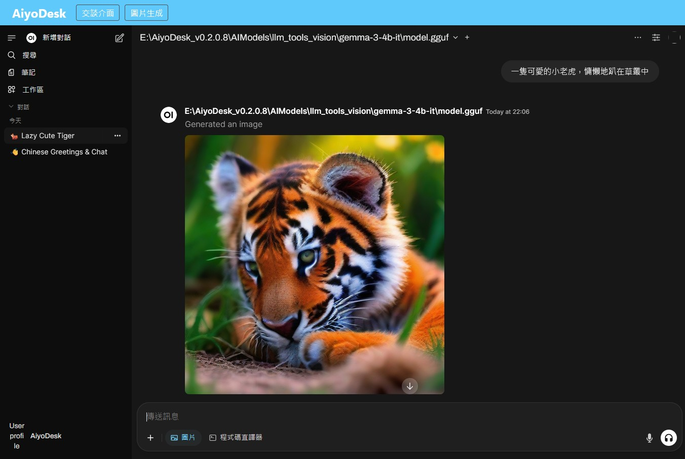
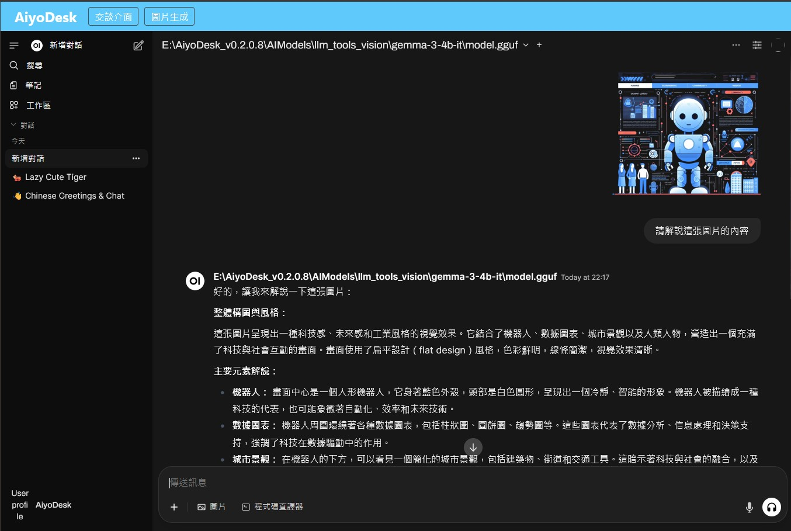
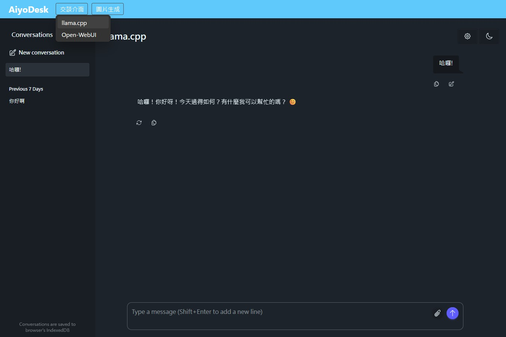
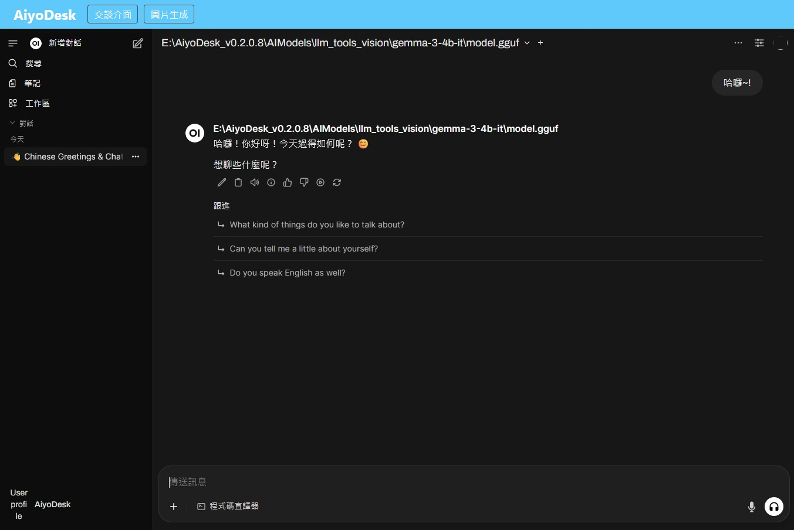
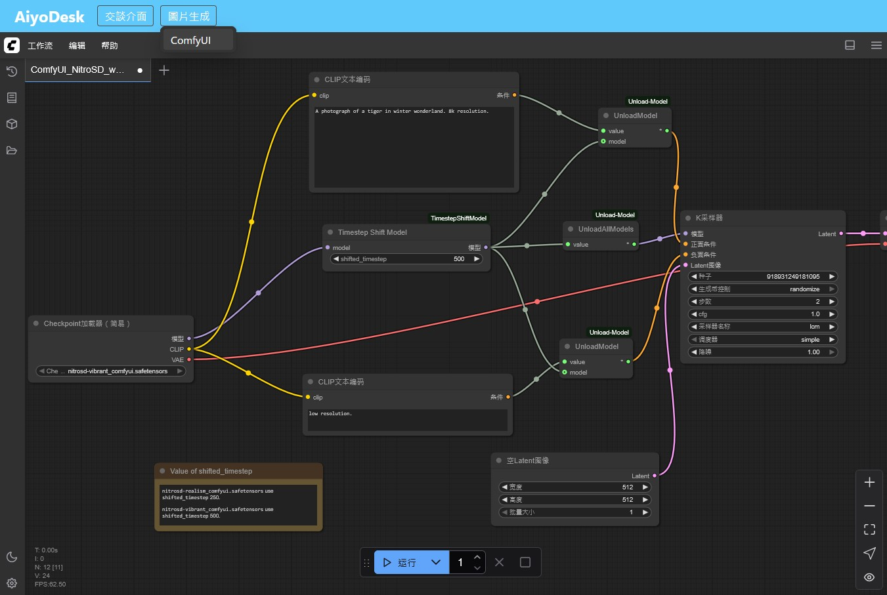

## **AiyoDesk**

**AiyoDesk** 是一款 GPL3.0 免費開源授權的整合軟體，設計宗旨在於「**以最低的硬體成本打造專用AI伺服器**」，目前已整合 Conda Miniforge、llama.cpp、Open-WebUI、ComfyUI 等軟體，可以在一般家用電腦順暢執行各種量化模型，同時在內網共享 **AI** 文字交談、影像辨識等功能。
 
 
| 直接在 Open-WebUI 生成圖片 | 影像辨識 |
| :-------: | :-------: |
|  |  |
 

### **功能特點**

- **乾淨安裝、輕鬆移除**
  
  透過 **AiyoDesk** 安裝的所有軟體套件，都執行於 Conda 虛擬環境內，不會寫入任何系統註冊表或環境變數，需要移除的時候只要將整個目錄刪除，不會留下任何痕跡或對系統造成負擔。這個特性也讓 **AiyoDesk** 很適合用來製作 Docker Image 或打造專用 AI 機台(導覽機、客服機、即時翻譯裝置等)。

- **易於使用的單一入口**

  **AiyoDesk** 附帶一個自託管的 http 服務及響應式網頁介面，從單一網址入口即可切換存取各個軟體套件，即使不熟悉電腦操作的區網或家庭成員，也可以輕鬆共同使用 AI 服務。
  | llama.cpp | Open-WebUI | ComfyUI |
  | :-------: | :-------: | :-------: |
  |  |  |  |

- 自動參數設置及管理

  **AiyoDesk** 會自動檢查並設定各軟體套件需要的設置，使用者不需要太多調整即可開始使用。

- 可離線執行也可線上協作

  初始化安裝完成之後，即可完全離線使用 AI 服務，需要的時候也可以透過 Open-WebUI 連接線上模型共同協作。

 

### **開始使用**

1. 下載最新預編譯版本 ，或 clone repo 之後自行使用 Visual Studio 2022 編譯(原始碼版本可能落後 **Release** 版本)。

2. 解壓縮，請注意存放的磁碟空間至少要有 30Gb 以上。

3. 執行 AiyoDesk.exe 啟動本軟體，第一次執行會自動切換到**初始化安裝**頁面，請參考頁面訊息操作。

4. 注意事項1: 初始化安裝可能需要下載超過 10Gb 的檔案，建議在穩定的網路環境進行。由於 **AiyoDesk** 的便攜設計，您也可以在其他裝置完成初始化安裝，再將整個路徑移動到目標裝置運行。

5. 注意事項2: 安裝 Open-WebUI 之後，會自動建立一個管理員帳號 desk@aiyo.app 密碼 12365478 ，第一次進入 Open-WebUI 請使用這組帳密進入，再新增其他使用者(如果有)。

 

### **後續發展**

以下功能預計將陸續整合:

- [基礎設施] 整合 STT、TTS 等語音模型模型以提供語音輸入及輸出功能。
- [基礎設施] 導入 https 協定以提升安全性。
- [基礎設施] 設計給 **AiyoDesk** 專用的瀏覽器，可以用於爬蟲或其他自動化操作。
- [客製化] 為各行各業及各種專門用途設計功能模組。
- [自我進化] 讓語言模型能夠針對使用者需求，自行撰寫 Tools 工具程式。

